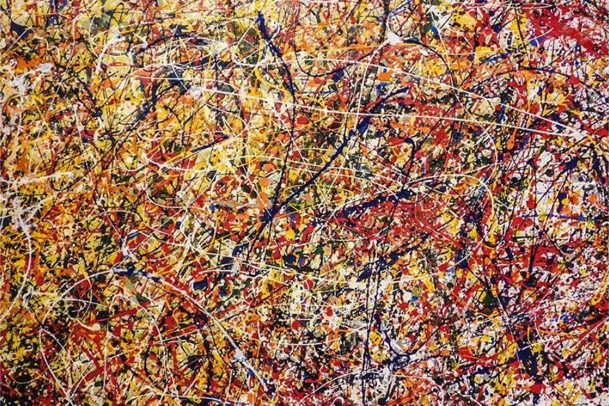

```{r setup, include=FALSE}
knitr::opts_chunk$set(echo = TRUE)
pacman::p_load(tidyverse,psych,knitr,magick,OpenImageR,gplots)
set.seed(12)
```

### 4) Exercício 30 da Lista 3  

Utilize a decomposição espectral $\Sigma = UDV^T$ para mostrar que $\sum_{i=1}^{n}Var(x_i)$ = $\sum_{i=1}^{n}\lambda_i$ , em que $\lambda_i$ são os elementos da matriz diagonal D.


```{r include=FALSE}
dados <- matrix(round(runif(16,min = 50,max = 100), 0),nrow = 4)

```

```{r echo=FALSE}
kable(dados)
```

Vamos calcular a matriz de covariancias!

```{r include=FALSE}
cov <- cov(dados)
```

```{r echo=FALSE}
kable(cov)
```

Vamos obter os autovetores e autovalores

```{r include=FALSE}
# Obtendo autovalores e autovetores
auto <- eigen(cov)
autovalores <- auto$values
autovetores <- auto$vectors
```


```{r echo=FALSE}
auto
```

Obtendo a matriz diagonal dos autovalores $D$

```{r include=FALSE}
# Obtendo a matriz diagonal de autovalores
D <- diag(autovalores)
```

```{r echo=FALSE}
kable(D)
```

\newpage

Matriz do autovetores $P$

```{r echo=FALSE}
# Obtendo a matriz de autovetores
P <- autovetores
```

```{r echo=FALSE}
kable(P)
```

Obtendo a matriz inversa dos autovetores $P^{-1}$

```{r include=FALSE}
# Obtendo a matriz de autovetores inversa
pinv_P <- solve(autovetores)
```

```{r echo=FALSE}
kable(pinv_P)
```

Obtendo a matriz de covariancias pela decomposição espectral por meio da seguinte equacao $PDP^{-1}$
```{r include=FALSE}
# Obtendo a matriz de decomposição espectral
decomp_espectral <- P %*% D %*% pinv_P
```


```{r echo=FALSE}
kable(decomp_espectral)
```


podemos perceber que voltamos para a matriz de covariancia 


Calculando a variância total somando a diagonal da matriz de covariancia
```{r include=FALSE}
# Calculando a variância total
var_total <- sum(diag(cov))
```

```{r echo=FALSE}
kable(var_total) 
```


Calculando a variância explicada por cada dimensao dividindo os autovalores pela variancia total
```{r include=FALSE}
# Calculando a variância explicada por cada dimensao
var_explicada <- autovalores / var_total

```

```{r echo=FALSE}
kable(var_explicada) 
```

checando se a soma da variancias (diagonal da matriz de covariancia) é igual a soma da diagonal dos autovalores

```{r echo=FALSE}
#checando se a soma da variancias (diagonal da matriz de covariancia) é iguala soma da diagonal dos autovalores
round(sum(autovalores),4) == round(sum(diag(cov)),4)
```


\newpage

### Realizando o problema anterior por meio do SVD

```{r include=FALSE}
AAT = cov %*% t(cov)
ATA = t(cov) %*% cov  
AAT_eigen = eigen(AAT)
ATA_eigen = eigen(ATA)
u = AAT_eigen$vectors[,1:3]
v = ATA_eigen$vectors[,1:3]
```
$A=U\Sigma V^T$ onde $U$ = autovetores de $AA^T$ e $V$ = autovetores de $A^TA$ logo vamos calcular $U$ e $V$

Matriz $U$
```{r echo=FALSE}
kable(u)
```

Matriz $V$
```{r echo=FALSE}
kable(v)
```

Calculando autovalores e autovetores
```{r echo=FALSE}
#Calculando autovalores e autovetores

cat("Autovetores de AAT:",round(AAT_eigen$values,5))
cat("Autovetores de ATA:",round(ATA_eigen$values,5))
```

Como temos os mesmos autovalores para $AA^T$ e $A^TA$ vamos calcular que é a matriz diagonal da raiz quadrada dos autovalores diferentes de 0
```{r include=FALSE}
# como temos os mesmos autovalores para AAT e ATA vamos calcular  que é a 
# matriz diagonal da raiz quadrada dos autovalores diferentes de 0

r = sqrt(ATA_eigen$values[1:3])
r = r * diag(length(r))
```


```{r echo=FALSE}
kable(r)
```
Juntando a matriz decomposta por meio da equacao $A=U\Sigma V^T$
```{r include=FALSE}
#juntando a matriz decomposta

matriz_svd = u %*% r %*% t(v) #podemos perceber que chegamos na mesma matriz original!
```

```{r echo=FALSE}
kable(matriz_svd)
```

\newpage
Comparando resultados com a funcao svd() do R

```{r echo=FALSE}
#comparando resultados com a funcao svd() do R

round(svd(cov)$d,4)
round(svd(cov)$u,4)
round(svd(cov)$v,4)
```

Calculando o traco da matriz de covariancias
```{r echo=FALSE}
#comparando a soma da diagonal das matrizes de covariancia com a soma da diagonal de r

tr(cov)
```

Calculando o traco da matriz D por meio da funcao svd()
```{r echo=FALSE}
sum(svd(cov)$d)
```

Calculando o traco da matriz D manualmente feito pelo R
```{r echo=FALSE}
sum(r)
```


Podemos ver que todos os resultados batem tanto no SVD quanto na decomposicao por autovalores!

\newpage

### 5) Exercício 31 da Lista 3 
Reproduza o estudo de redução de dimensão SVD de imagens, utilizando duas imagens. A primeira com poucos detalhes (abstrata, por exemplo) e a segunda com vários detalhes. Justifique sua escolha de dimensão na redução de cada imagem e compare os resultados. Você achou a redução compatível com as imagens utilizadas? Justifique.

Para realizacao da questao, foi utilizado o seguinte codigo com base no codigo disponibilizado no aprender pelo professor!

```{r}
#funçao para comprimir a imagem (img é a imagem escolhida e x é a quantidade de dimensoes)

compression <- function(img,x) {
  img = readImage(img) %>%
    rgb_2gray()
  img_svd = svd(img)
  D = diag(img_svd$d)
  U = img_svd$u
  V = img_svd$v
  U5 <- as.matrix(U[,1:x])
  V5 <- as.matrix(V[,1:x])
  D5 <- diag(img_svd$d[1:x])
  img_gray <- U5 %*% D5 %*% t(V5)
  
  cat("Com x = ",x,"a imagem contem",tr(D5)/tr(D) * 100, "% da variancia total") 
  return(img_gray)
}
```

\newpage

As imagems escolhidas foram:

```{r echo=FALSE, fig.align='center', out.width="90%"}
 

```

\newpage

```{r}
imagem_comprimida = compression(img = "barco.jpg",x = 20)
```

```{r echo=FALSE}
imageShow(imagem_comprimida)
```

\newpage

```{r}
imagem_comprimida = compression(img = "imagem_abstrata.jpg",x = 70)
```

```{r echo=FALSE}
imageShow(imagem_comprimida)
```

Os valores de $x = 20$ e $x = 70$ foram escolhidos pois eu acredito que sao os valores em que da pra identificar melhor o que a imagem quer representar! Vale notar a diferenca de complexidade entre as imagens, enquanto que o barco foi necessario somente 20 para ter uma boa representacao da imagem original, o quadro precisou de 70 para que ficasse claro o que era pra ser representado

